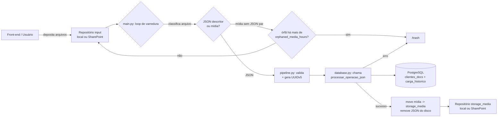

<details>
    <summary>Índice</summary>
    <ol>
        <li><a href="#visão-geral">Visão Geral</a></li>
        <li><a href="#arquitetura">Arquitetura</a></li>
        <li><a href="#estrutura-do-repositório">Estrutura do Repositório</a></li>
        <li><a href="#pré-requisitos">Pré-requisitos</a></li>
        <li><a href="#como-rodar-localmente">Como Rodar Localmente</a></li>
        <li><a href="#estrutura-do-podman-compose">Estrutura do Podman Compose</a></li>
        <li><a href="#visão-geral-da-configuração">Visão Geral da Configuração</a></li>
        <li><a href="#como-funciona-o-processamento">Como Funciona o Processamento</a></li>
        <li><a href="#licença-e-contribuição">Licença e Contribuição</a></li>
    </ol>
</details>

## Visão geral

O Scarab é um serviço de ingestão e persistência de documentos e metadados. A nova arquitetura
substitui a saída em arquivos por um armazenamento centralizado em PostgreSQL: o serviço recebe
descritores JSON (com ou sem mídia), valida e normaliza o payload, calcula um identificador
determinístico (UUIDv5) e delega a persistência a funções armazenadas no banco. Mídias são
armazenadas em repositórios configuráveis (local ou SharePoint) e vinculadas ao registro no banco.

O objetivo é tornar a ingestão robusta, audível e compatível com orquestração via containers
(Podman), mantendo políticas de segurança para segredos, limpeza de arquivos órfãos e proteção
contra path traversal e injeção SQL.

<div>
    <a href="#visão-geral" title="De volta ao topo da página">
        
    </a>
    <br><br>
</div>

## Arquitetura

Diagrama de alto nível do fluxo de dados:



Principais componentes:
- `src/main.py`: loop principal e tratamento de sinais.
- `src/pipeline.py`: validação, cálculo de UUIDv5 e orquestração por carga.
- `src/database.py`: conexão com PostgreSQL e chamada à função `processar_operacao_json`.
- `src/storage_manager.py`: abstração de repositórios (local / SharePoint) e sanitização de nomes.
- `db/`: scripts SQL com `clientes_docs`, `carga_historico` e `processar_operacao_json`.

O contrato técnico completo da configuração, dos módulos Python, do banco e das regras de
segurança está em [docs/architecture/CONTRACTS.md](docs/architecture/CONTRACTS.md).

<div>
    <a href="#visão-geral" title="De volta ao topo da página">
        
    </a>
    <br><br>
</div>

## Estrutura do repositório

Árvore principal (resumida):


<div>
    <a href="#visão-geral" title="De volta ao topo da página">
        
    </a>
    <br><br>
</div>

## Pré-requisitos

- Podman (para orquestrar containers com `podman-compose`).
- UV (gerenciador de ambiente usado no desenvolvimento): `uv sync` para instalar dependências.
- Acesso a um PostgreSQL (pode ser provisionado via `containers/podman-compose.yml`).

<div>
    <a href="#visão-geral" title="De volta ao topo da página">
        
    </a>
    <br><br>
</div>

## Como rodar localmente

1. Clone o repositório:

```powershell
git clone <repo> && cd Scarab
```

2. Instale dependências de desenvolvimento com UV:

```powershell
uv sync
```

3. Copie o arquivo de configuração e ajuste conforme necessário:

```powershell
mkdir -Force config; copy-file config/default_config.json config/config.json
# editar config/config.json (senha do banco via variável de ambiente)
```

4. Suba os containers (aplica-se quando `containers/podman-compose.yml` estiver presente):

```powershell
podman compose -f containers/podman-compose.yml up
```

5. No ambiente de desenvolvimento, execute ciclos de inspeção com UV:

```powershell
uv run python -m src.main config
```

Observação: segredos como a senha do banco devem ser fornecidos via variável de ambiente
(`SCARAB_DB_PASSWORD` conforme `config/default_config.json`).

<div>
    <a href="#visão-geral" title="De volta ao topo da página">
        
    </a>
    <br><br>
</div>

## Estrutura do Podman Compose

O arquivo [containers/podman-compose.yml](containers/podman-compose.yml) define os serviços `db` e
`app`, uma rede interna criada automaticamente pelo Compose e o volume nomeado `db_data`. Os
caminhos relativos usados pelo Compose partem do diretório `containers`; por isso, por exemplo,
`../config` corresponde à pasta `config` na raiz do repositório.

### Serviço `db`

O serviço de banco é construído com `containers/Containerfile.db`, baseado no PostgreSQL 16. Os
scripts `db/init.sql` e `db/procedures.sql` são incluídos na imagem e executados, nessa ordem,
somente quando o diretório de dados do PostgreSQL está vazio.

- `env_file` carrega as variáveis de `../.env` usadas na inicialização do PostgreSQL.
- A porta `5432` do host é encaminhada para a porta `5432` do container.
- O volume `db_data` preserva o cluster PostgreSQL entre recriações do container.
- O `healthcheck` usa `pg_isready`; o serviço `app` só inicia depois que o banco está saudável.
- `restart: unless-stopped` reinicia o serviço após falhas ou reinicializações do Podman, exceto
    quando ele tiver sido parado explicitamente.

O volume `db_data` não é uma pasta versionada dentro do repositório. É um volume gerenciado pelo
Podman e armazenado na área de dados do próprio mecanismo. Seu nome efetivo pode receber o prefixo
do projeto Compose.

### Serviço `app`

O serviço da aplicação é construído com `containers/Containerfile.app`. A imagem instala as
dependências, executa o Scarab como usuário não privilegiado e inicia
`python -m src.main /app/config`. Os serviços compartilham a rede interna do Compose; nessa rede,
o nome `db` resolve para o container PostgreSQL. Portanto, a configuração usada no container deve
definir `database.host` como `db`, e não como `localhost`.

### Mapeamentos entre host e containers

| Origem no host | Destino no container | Tipo e acesso | Finalidade |
|---|---|---|---|
| Volume Podman `db_data` | `/var/lib/postgresql/data` no `db` | Volume nomeado, leitura e escrita | Armazenamento persistente das tabelas, índices e histórico do PostgreSQL. |
| `config/` | `/app/config` no `app` | Bind mount somente leitura (`ro`) | Disponibiliza `default_config.json` e o override local `config.json`. |
| `.env` | Ambiente dos processos `db` e `app` | `env_file`; não é um volume | Injeta variáveis e segredos sem copiar nem montar o arquivo dentro dos containers. |
| `examples/sandbox/` | `/mnt/share01` no `app` | Bind mount de leitura e escrita com rótulo SELinux privado (`Z`) | Publica, somente para o teste funcional, as pastas de entrada, saída e descarte. |

Os bind mounts mantêm a pasta real no host: uma alteração feita de um lado é vista imediatamente
do outro. O conteúdo também permanece no host quando o container é removido. No caso de `config`,
o sufixo `ro` impede que a aplicação modifique os arquivos. Esse mount sobrepõe, durante a
execução, a configuração que foi copiada para a imagem no processo de build.

O arquivo `.env` tem comportamento diferente. Ele permanece apenas no host e o Compose usa seus
valores para criar o ambiente de cada processo, incluindo os segredos referenciados pela
configuração, como `SCARAB_DB_PASSWORD`. Alterações no `.env` exigem a recriação dos containers para
que as novas variáveis sejam aplicadas. Tanto `.env` quanto `config/config.json` são ignorados pelo
Git para evitar o versionamento de segredos e ajustes locais.

O sufixo `Z` no mount do sandbox solicita ao Podman um rótulo SELinux privado compatível com o
acesso pelo container. Ele é relevante principalmente em hosts Linux com SELinux habilitado.

### Pastas de trabalho do sandbox

O `config.json` do cenário funcional usa caminhos sob `/mnt/share01`. O nome interno segue uma
convenção adequada a mounts Linux e não expõe no container que a origem publicada é um sandbox:

- `/mnt/share01/post`: repositório de entrada monitorado pelo Scarab; recebe descritores JSON e mídias.
- `/mnt/share01/get`: repositório de saída que recebe as mídias associadas após uma operação bem-sucedida.
- `/mnt/share01/trash`: recebe arquivos rejeitados e mídias consideradas órfãs.
- `temp`: área reservada, sem uso explícito no pipeline atual.
- `store`: área legada do cenário, sem uso pelo pipeline atual.

O fluxo de um teste começa quando arquivos são colocados em `examples/sandbox/post` no host. A
aplicação os enxerga em `/mnt/share01/post`, grava os metadados no PostgreSQL e move as mídias para
`/mnt/share01/get` ou os arquivos rejeitados para `/mnt/share01/trash`. Como toda a pasta
`sandbox` está montada em leitura e escrita, esses movimentos ficam visíveis no host.

Para usar o cenário fornecido, copie seu override para a pasta de configuração montada antes de
subir os serviços:

```powershell
Copy-Item examples/sandbox/config.json config/config.json
podman compose -f containers/podman-compose.yml up --build
```

O `sandbox` é uma área efêmera de execução, embora o bind mount faça seus arquivos sobreviverem à
remoção do container. Restaure-o antes de outro teste para obter um estado conhecido. Consulte
[examples/README.md](examples/README.md) para o uso dos scripts de restauração e armazenamento dos
cenários.

### Substituição obrigatória em produção

O bind mount `../examples/sandbox:/mnt/share01:Z` existe para que o repositório publicado execute o
teste funcional sem depender de diretórios externos. Ele não representa armazenamento de produção.
Antes da implantação, substitua a origem `../examples/sandbox` por um diretório ou filesystem
permanente do host, com backup, capacidade, ownership e permissões definidos pela operação.

Os destinos `/mnt/share01`, `/mnt/share02` e assim por diante são identificadores estáveis dentro
do container. Eles não precisam ter o mesmo nome no host. Um override de produção com dois
repositórios locais pode, por exemplo, conter:

```yaml
services:
    app:
        volumes:
            - /srv/scarab/share01:/mnt/share01:Z
            - /srv/scarab/share02:/mnt/share02:Z
```

Nesse caso, a configuração pode manter a entrada e a lixeira sob `/mnt/share01` e definir um
repositório de mídia em `/mnt/share02/media`. Cada novo `repository.path` local deve estar sob um
ponto de montagem declarado em `volumes`; declarar o caminho apenas no JSON não cria nem persiste
o volume.

### Persistência e remoção

- `podman compose -f containers/podman-compose.yml down` remove os containers e a rede, mas mantém
    o volume `db_data` e todas as pastas montadas do host.
- O mesmo comando com `--volumes` também remove `db_data` e, portanto, apaga o banco persistido.
- `config/`, `.env` e a origem associada a `/mnt/shareNN` não são apagados por `down --volumes`,
    pois são arquivos e diretórios reais do host, não volumes nomeados do Compose.
- Alterar os scripts SQL e reconstruir a imagem não reaplica a inicialização em um `db_data` já
    populado. Para uma inicialização limpa, remova deliberadamente o volume ou aplique uma migração.

<div>
        <a href="#visão-geral" title="De volta ao topo da página">
                
        </a>
        <br><br>
</div>

## Visão geral da configuração

O arquivo `config/default_config.json` concentra os parâmetros principais:
- `repositories`: lista de repositórios com `type` (`local` | `sharepoint`) e `role` (`input` | `storage_media`).
- `prazos`: `orphaned_media_hours` (horas para considerar mídia órfã) e `trash_cleanup_days` (idade para compactação/purge).
- `trash_path`: diretório local da lixeira para arquivos rejeitados e mídias órfãs.
- `max_file_size_bytes`: limite verificado antes de carregar descritores ou mídias em memória.
- `database`: parâmetros de conexão (host, port, dbname, user) e `password_env` (nome da variável de ambiente que guarda a senha).
- `uuid_namespace`: UUID literal usado como namespace para `uuid.uuid5()` (não recalculado em runtime).
- `business_key_field`: se vazio (`""`), o UUIDv5 é calculado a partir de todo o payload (excluindo campos de controle); se preenchido, o campo indicado é usado como fonte limpa para o hash.

O `config/config.json` (gitignored) pode sobrescrever qualquer campo do default por seção.

<div>
    <a href="#visão-geral" title="De volta ao topo da página">
        
    </a>
    <br><br>
</div>

## Como funciona o processamento

Fluxo resumido:
1. O `main.py` varre repositórios `role == "input"` procurando novos arquivos.
2. Arquivos JSON são validados; o campo `operacao` deve existir e ser um dos literais suportados.
3. O `pipeline.py` resolve a fonte do `business key` (campo específico ou todo o payload limpo), aplica
   normalização (`clean_business_key`) e calcula `uuid.uuid5(namespace, source)`.
4. A aplicação chama `database.py` que executa a função SQL `processar_operacao_json(nome_arquivo, payload)`.
5. A função no banco realiza `UPSERT` / `DELETE` / remoção de propriedade conforme a `operacao`, e registra a execução em `carga_historico`.
6. Se houver mídia associada, após sucesso a mídia é movida para um repositório com `role == "storage_media"`.
7. Mídias sem JSON correspondente são mantidas por `orphaned_media_hours` e, após esse período, movidas para `/trash`.

Rotina de lixeira e manutenção: compactação periódica dos arquivos em `/trash` e remoção de arquivos mais antigos que `prazos.trash_cleanup_days`.

<div>
    <a href="#visão-geral" title="De volta ao topo da página">
        
    </a>
    <br><br>
</div>

## Itens a fazer / melhorias

- Implementar API REST usando PostgREST
- Implementar API para upload de mídia via HTTP usando 
- [CONTRIBUTING.md](CONTRIBUTING.md)
- [CODE_OF_CONDUCT.md](CODE_OF_CONDUCT.md)
- [SECURITY.md](SECURITY.md)
- [SUPPORT.md](SUPPORT.md)

Por favor, siga as diretrizes de contribuição e o código de conduta ao enviar PRs.

<div>
    <a href="#visão-geral" title="De volta ao topo da página">
        
    </a>
    <br><br>
</div>

## Licença e contribuição

Este repositório mantém os arquivos de política e contribuição na raiz. Consulte:

- [LICENSE.md](LICENSE.md)
- [CONTRIBUTING.md](CONTRIBUTING.md)
- [CODE_OF_CONDUCT.md](CODE_OF_CONDUCT.md)
- [SECURITY.md](SECURITY.md)
- [SUPPORT.md](SUPPORT.md)

Por favor, siga as diretrizes de contribuição e o código de conduta ao enviar PRs.

<div>
    <a href="#visão-geral" title="De volta ao topo da página">
        
    </a>
    <br><br>
</div>
