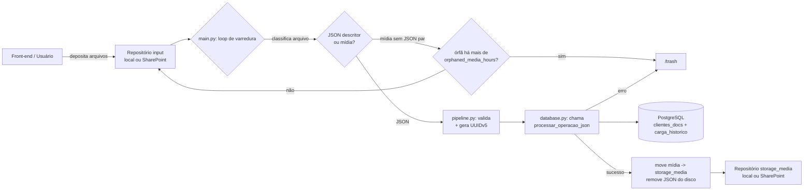

<details>
    <summary>Índice</summary>
    <ol>
        <li><a href="#visão-geral">Visão Geral</a></li>
        <li><a href="#arquitetura">Arquitetura</a></li>
        <li><a href="#estrutura-do-repositório">Estrutura do Repositório</a></li>
        <li><a href="#pré-requisitos">Pré-requisitos</a></li>
        <li><a href="#como-rodar-localmente">Como Rodar Localmente</a></li>
        <li><a href="#estrutura-do-podman-compose">Estrutura do Podman Compose</a></li>
        <li><a href="#implantação-remota-e-testes">Implantação Remota e Testes</a></li>
        <li><a href="#visão-geral-da-configuração">Visão Geral da Configuração</a></li>
        <li><a href="#como-funciona-o-processamento">Como Funciona o Processamento</a></li>
        <li><a href="#licença-e-contribuição">Licença e Contribuição</a></li>
    </ol>
</details>

## Visão geral

O Scarab é um serviço de ingestão e persistência de documentos e metadados. A nova arquitetura
substitui a saída em arquivos por um armazenamento centralizado em PostgreSQL: o serviço recebe
descritores JSON (com ou sem mídia), valida e normaliza o payload, calcula um identificador
determinístico (UUIDv5) e delega a persistência a funções armazenadas no banco. Mídias são
armazenadas em repositórios configuráveis (local ou SharePoint) e vinculadas ao registro no banco.

O objetivo é tornar a ingestão robusta, audível e compatível com orquestração via containers
(Podman), mantendo políticas de segurança para segredos, limpeza de arquivos órfãos e proteção
contra path traversal e injeção SQL.

<div>
    <a href="#visão-geral" title="De volta ao topo da página">
        
    </a>
    <br><br>
</div>

## Arquitetura

Diagrama de alto nível do fluxo de dados:



Principais componentes:
- `src/main.py`: loop principal e tratamento de sinais.
- `src/pipeline.py`: validação, cálculo de UUIDv5 e orquestração por carga.
- `src/database.py`: conexão com PostgreSQL e chamada à função `processar_operacao_json`.
- `src/storage_manager.py`: abstração de repositórios (local / SharePoint) e sanitização de nomes.
- `db/`: scripts SQL com `clientes_docs`, `carga_historico` e `processar_operacao_json`.

O contrato técnico completo da configuração, dos módulos Python, do banco e das regras de
segurança está em [docs/architecture/CONTRACTS.md](docs/architecture/CONTRACTS.md).

<div>
    <a href="#visão-geral" title="De volta ao topo da página">
        
    </a>
    <br><br>
</div>

## Estrutura do repositório

Árvore principal (resumida):


<div>
    <a href="#visão-geral" title="De volta ao topo da página">
        
    </a>
    <br><br>
</div>

## Pré-requisitos

- Podman (para orquestrar containers com `podman-compose`).
- UV (gerenciador de ambiente usado no desenvolvimento): `uv sync` para instalar dependências.
- Acesso a um PostgreSQL (pode ser provisionado via `containers/podman-compose.yml`).

<div>
    <a href="#visão-geral" title="De volta ao topo da página">
        
    </a>
    <br><br>
</div>

## Como rodar localmente

1. Clone o repositório:

```powershell
git clone <repo> && cd Scarab
```

2. Instale dependências de desenvolvimento com UV:

```powershell
uv sync
```

3. Para executar somente o daemon fora de containers, crie um override e ajuste o banco para um
    PostgreSQL acessível pela estação:

```powershell
New-Item -ItemType Directory -Force config | Out-Null
Copy-Item config/default_config.json config/config.json
# editar config/config.json, inclusive database.host
$env:SCARAB_DB_PASSWORD = "<senha-local>"
```

4. Execute ciclos de inspeção com UV:

```powershell
uv run python -m src.main config
```

O stack completo deve ser instalado em um host Linux com `scarab-deploy`, conforme a seção
[Implantação remota e testes](#implantação-remota-e-testes). O Compose de runtime exige caminhos
FHS provisionados e não deve ser iniciado diretamente do checkout.

<div>
    <a href="#visão-geral" title="De volta ao topo da página">
        
    </a>
    <br><br>
</div>

## Estrutura do Podman Compose

O runtime usa [containers/podman-compose.yml](containers/podman-compose.yml) em todos os ambientes.
Esse arquivo não contém build nem caminhos do checkout. O override
[containers/podman-compose.build.yml](containers/podman-compose.build.yml) acrescenta build somente
no laboratório. [containers/scarab-deploy.sh](containers/scarab-deploy.sh) instala e opera ambos.

No host, cada instância segue a hierarquia Linux:

| Host | Finalidade | Container |
|---|---|---|
| `/etc/<instância>/config` | Configuração somente leitura | `/etc/scarab` |
| `/var/lib/<instância>/postgresql` | Estado do PostgreSQL | `/var/lib/postgresql/data` |
| `/srv/<instância>/share01` | Entrada e lixeira | `/mnt/share01` |
| `/srv/<instância>/share02` | Mídia final | `/mnt/share02` |
| `/var/log/<instância>` | Logs em arquivo opcionais | `/var/log/scarab` |
| `/var/backups/<instância>` | Backups lógicos no host | não montado |

O código e as dependências são imutáveis na imagem em `/opt/scarab`. Nenhum diretório do checkout
é montado em runtime.

### Serviço `db`

O PostgreSQL usa bind mount persistente sob `/var/lib/<instância>` e não publica a porta 5432. A
imagem executa schema, procedures e criação idempotente do papel `scarab_app` na primeira
inicialização. O instalador reaplica senha e grants mínimos em updates.

### Serviço `app`

O app executa como usuário não-root com filesystem raiz somente leitura, `/tmp` em `tmpfs`, sem
capabilities e com `no-new-privileges`. Os serviços usam rede interna e `database.host: "db"`.
`keep-id` permite escrita nos shares pelo proprietário rootless do host sem permissões globais.

<div>
        <a href="#visão-geral" title="De volta ao topo da página">
                
        </a>
        <br><br>
</div>

## Implantação remota e testes

O fluxo remoto recomendado mantém checkout, build, containers e bind mounts no host Linux. A
estação de trabalho acessa esse host por SSH; não é necessário instalar Podman localmente para usar
as tarefas incluídas em [.vscode/tasks.json](.vscode/tasks.json).

Depois de configurar o SSH, instale uma instância de teste no host:

```bash
sudo bash containers/scarab-deploy.sh install \
    --environment test \
    --instance scarab-test \
    --service-user "$(id -un)" \
    --source "$PWD"

scarab-deploy update --instance scarab-test
scarab-deploy test --instance scarab-test
```

O laboratório usa `/etc/scarab-test`, `/var/lib/scarab-test`, `/srv/scarab-test` e
`/var/backups/scarab-test`, exatamente como produção usa os caminhos sem `-test`. Somente o
desenvolvimento constrói imagens do checkout; runtime nunca monta o source. Para homologação com
paridade completa, forneça ao instalador os mesmos digests de imagem que serão promovidos para
produção.

Também é possível executar **Tasks: Run Task** no VS Code:

- `Scarab remoto: verificar acesso` valida SSH, Podman, Compose e o checkout;
- `Scarab remoto: sincronizar alteracoes locais` envia arquivos modificados sem copiar `.env` ou
    `config/config.json`;
- `Scarab remoto: testes unitarios Linux` executa a suíte em um container descartável;
- `Scarab remoto: validar Compose`, `subir e reconstruir`, `teste funcional`, `status`, `logs`,
    `backup do banco` e `parar` operam a instância instalada.

O teste funcional envia fixtures instaladas em `/srv/scarab-test/fixtures` e exige dois registros
finais e seis entradas `SUCESSO`. Produção usa imagens imutáveis de registry, conta rootless
dedicada, segredos provisionados e filesystems permanentes, mas conserva a mesma topologia.

O procedimento completo, incluindo bootstrap seguro, comandos de validação, reset do laboratório
e matriz de diferenças para produção, está na
[Wiki: Podman Compose em servidor remoto](https://github.com/InovaFiscaliza/Scarab/wiki/Podman-Compose-Servidor-Remoto).

<div>
        <a href="#visão-geral" title="De volta ao topo da página">
                
        </a>
        <br><br>
</div>

## Visão geral da configuração

O arquivo `config/default_config.json` concentra os parâmetros principais:
- `repositories`: lista de repositórios com `type` (`local` | `sharepoint`) e `role` (`input` | `storage_media`).
- `prazos`: `orphaned_media_hours` (horas para considerar mídia órfã) e `trash_cleanup_days` (idade para compactação/purge).
- `trash_path`: diretório local da lixeira para arquivos rejeitados e mídias órfãs.
- `max_file_size_bytes`: limite verificado antes de carregar descritores ou mídias em memória.
- `database`: parâmetros de conexão (host, port, dbname, user) e `password_env` (nome da variável de ambiente que guarda a senha).
- `uuid_namespace`: UUID literal usado como namespace para `uuid.uuid5()` (não recalculado em runtime).
- `business_key_field`: se vazio (`""`), o UUIDv5 é calculado a partir de todo o payload (excluindo campos de controle); se preenchido, o campo indicado é usado como fonte limpa para o hash.

O `config/config.json` (gitignored) pode sobrescrever qualquer campo do default por seção.

<div>
    <a href="#visão-geral" title="De volta ao topo da página">
        
    </a>
    <br><br>
</div>

## Como funciona o processamento

Fluxo resumido:
1. O `main.py` varre repositórios `role == "input"` procurando novos arquivos.
2. Arquivos JSON são validados; o campo `operacao` deve existir e ser um dos literais suportados.
3. O `pipeline.py` resolve a fonte do `business key` (campo específico ou todo o payload limpo), aplica
   normalização (`clean_business_key`) e calcula `uuid.uuid5(namespace, source)`.
4. A aplicação chama `database.py` que executa a função SQL `processar_operacao_json(nome_arquivo, payload)`.
5. A função no banco realiza `UPSERT` / `DELETE` / remoção de propriedade conforme a `operacao`, e registra a execução em `carga_historico`.
6. Se houver mídia associada, após sucesso a mídia é movida para um repositório com `role == "storage_media"`.
7. Mídias sem JSON correspondente são mantidas por `orphaned_media_hours` e, após esse período, movidas para `/trash`.

Rotina de lixeira e manutenção: compactação periódica dos arquivos em `/trash` e remoção de arquivos mais antigos que `prazos.trash_cleanup_days`.

<div>
    <a href="#visão-geral" title="De volta ao topo da página">
        
    </a>
    <br><br>
</div>

## Itens a fazer / melhorias

- Implementar API REST usando PostgREST
- Implementar API para upload de mídia via HTTP usando 
- [CONTRIBUTING.md](CONTRIBUTING.md)
- [CODE_OF_CONDUCT.md](CODE_OF_CONDUCT.md)
- [SECURITY.md](SECURITY.md)
- [SUPPORT.md](SUPPORT.md)

Por favor, siga as diretrizes de contribuição e o código de conduta ao enviar PRs.

<div>
    <a href="#visão-geral" title="De volta ao topo da página">
        
    </a>
    <br><br>
</div>

## Licença e contribuição

Este repositório mantém os arquivos de política e contribuição na raiz. Consulte:

- [LICENSE.md](LICENSE.md)
- [CONTRIBUTING.md](CONTRIBUTING.md)
- [CODE_OF_CONDUCT.md](CODE_OF_CONDUCT.md)
- [SECURITY.md](SECURITY.md)
- [SUPPORT.md](SUPPORT.md)

Por favor, siga as diretrizes de contribuição e o código de conduta ao enviar PRs.

<div>
    <a href="#visão-geral" title="De volta ao topo da página">
        
    </a>
    <br><br>
</div>
