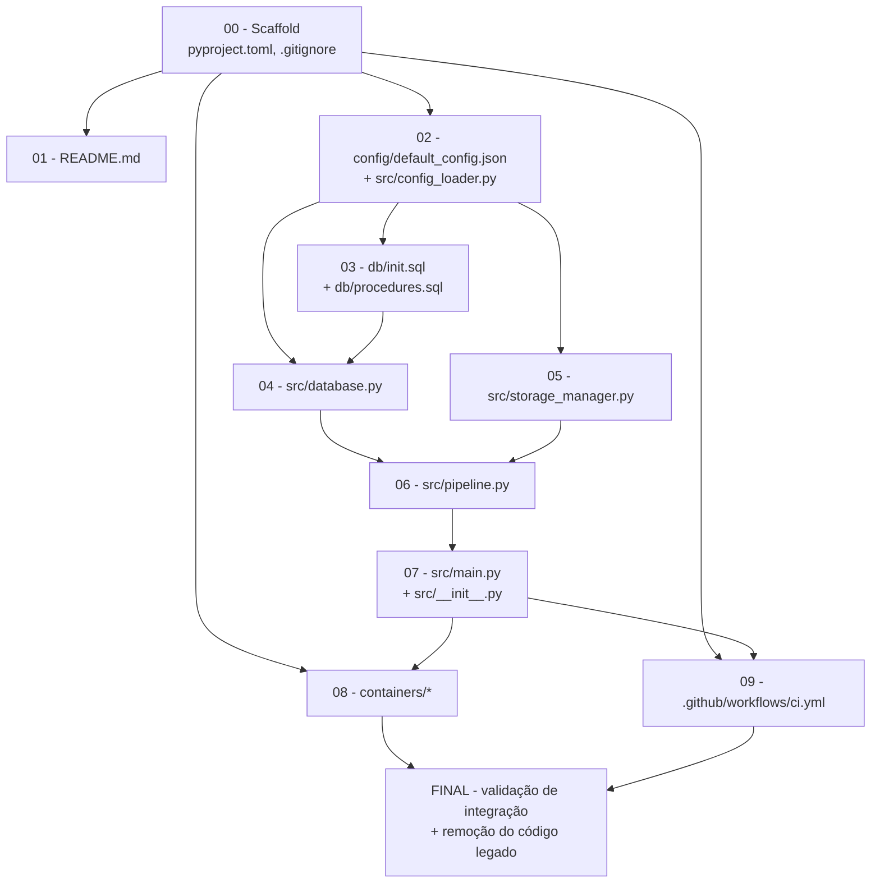

# Plano de Reescrita — Scarab (Arquitetura PostgreSQL/Podman)

> Status: **Planejamento concluído. Nenhum código da nova arquitetura foi gerado ainda.**
> Este documento orienta os próximos prompts de codificação, módulo a módulo.
> Esquemas e assinaturas detalhados estão em [CONTRACTS.md](./CONTRACTS.md) — leia os dois em
> conjunto antes de implementar qualquer módulo.

## Sumário
1. [Objetivo e escopo](#1-objetivo-e-escopo)
2. [Mapeamento: Scarab atual → Nova arquitetura](#2-mapeamento-scarab-atual--nova-arquitetura)
3. [Arquitetura alvo](#3-arquitetura-alvo)
4. [Ordem de construção dos módulos](#4-ordem-de-construção-dos-módulos)
5. [Como orquestrar os agentes módulo a módulo](#5-como-orquestrar-os-agentes-módulo-a-módulo)
6. [Estratégia de risco e rollback](#6-estratégia-de-risco-e-rollback)
7. [Segurança (resumo — detalhe em CONTRACTS.md §4)](#7-segurança-resumo)
8. [Decisões pendentes / perguntas em aberto](#8-decisões-pendentes--perguntas-em-aberto)
9. [Próximos passos imediatos](#9-próximos-passos-imediatos)

---

## 1. Objetivo e escopo

Substituir completamente a arquitetura atual do Scarab (monitoramento de pastas + consolidação de
metadados em arquivos XLSX/CSV/JSON/QVD/Parquet) por um novo serviço:

- Front-end deposita arquivos (JSON descritor + mídia opcional) em diretórios monitorados (locais
  ou SharePoint).
- Um serviço Python (gerenciado com **UV**) processa, valida, calcula um **UUIDv5** determinístico
  a partir de uma chave de negócio, e delega toda a persistência a **Stored Procedures/Functions**
  em **PostgreSQL**, usando **JSONB** nativo.
- Deploy automatizado via **Podman** (`podman-compose`), com containers separados para a aplicação
  e o banco.

O código atual (`scarab.py`, `config_handler.py`, `metadata_handler.py`, `file_handler.py`,
`log_handler.py`) já foi **arquivado em `legacy/src/`** (junto com `legacy/tests/`), e será
**removido definitivamente** apenas como último passo, depois que a nova arquitetura estiver
implementada e validada (ver §6).

## 2. Mapeamento: Scarab atual → Nova arquitetura

| Conceito atual (`legacy/src/default_config.json` / `legacy/src/config_handler.py`) | Novo conceito | Observação |
|---|---|---|
| `folders.post` (lista de pastas de entrada) | `repositories[].role == "input"` | Generaliza para local **e** SharePoint |
| `folders.get` (dict regex → pastas de saída) | `repositories[].role == "storage_media"` | Somente mídia; dados estruturados vão para o banco |
| `folders.store` (catálogo XLSX/CSV/JSON/QVD/Parquet consolidado) | Banco PostgreSQL (`clientes_docs` + `carga_historico`) | **Eliminado** como arquivo — substituído integralmente pelo banco |
| `folders.temp` | Diretório de trabalho do container `app` | Ainda útil para download temporário (ex.: SharePoint) |
| `folders.trash` | Mantido: `/trash`, agora com **compactação periódica** (novo) | `prazos.trash_cleanup_days` |
| `metadata.association` (PK/FK multi-tabela, `relative value`, `int type`) | **Eliminado** | Substituído por UUIDv5 + JSONB único por registro (sem relações multi-tabela) |
| `null string values` | `null_string_values` | Mantido para sanitizar a chave de negócio antes do hash |
| `overwrite data in store/get/trash` | UPSERT sempre ativo no banco (`ON CONFLICT DO UPDATE`); overwrite de mídia local ainda configurável no `storage_manager` | Semântica muda de "flag" para "comportamento padrão do banco" |
| `clean period in hours` / `last clean` | `prazos.trash_cleanup_days` | Mesma ideia, escopo redefinido para compactação |
| *(inexistente)* | `prazos.orphaned_media_hours` | **Novo**: tempo de espera por descritor JSON antes de mover mídia órfã para `/trash` |
| `check period in seconds` | `check_period_seconds` | Mantido, mesmo papel no loop principal |
| `maximum errors before exit` | `maximum_errors_before_exit` | Mantido |
| `filename data format` / `filename data processing rules` | Não migrado no escopo inicial | Pode ser reintroduzido depois, se necessário (ver §8) |
| `csv separator`, `catalog names`, `table names`, `metadata.key` (multi-tabela) | **Eliminados** | Não há mais múltiplos formatos de arquivo de saída nem múltiplas tabelas por arquivo |
| `log.*` (nível, tela/arquivo, formato colorido) | `log.*` | Mesma filosofia, nomes de campo em `snake_case` |
| Docstring literal por atributo de config (hover no VS Code) | Mantido em `config_loader.py` | Convenção explicitamente reaproveitada |
| `signal.signal(SIGTERM/SIGBREAK/SIGINT, ...)` + loop com `time.sleep` (`legacy/src/scarab.py`) | Mesmo padrão em `src/main.py` | Reaproveitado quase sem alteração |

## 3. Arquitetura alvo

```
├── .github/workflows/ci.yml
├── containers/
│   ├── Containerfile.app
│   ├── Containerfile.db
│   └── podman-compose.yml
├── config/
│   ├── default_config.json
│   └── config.json            # gitignored
├── db/
│   ├── init.sql
│   └── procedures.sql
├── src/
│   ├── __init__.py
│   ├── main.py
│   ├── config_loader.py
│   ├── database.py
│   ├── storage_manager.py
│   └── pipeline.py
├── tests/                      # suíte pytest (aprovada pelo usuário; não estava no layout original)
│   ├── test_config_loader.py
│   ├── test_database.py
│   ├── test_storage_manager.py
│   └── test_pipeline.py
├── pyproject.toml
├── README.md
└── .gitignore
```

O código legado já foi arquivado em `legacy/` (`legacy/src/`, `legacy/tests/`) — `src/` e `tests/`
na raiz são recriados do zero pelos módulos novos, sem mistura com o código antigo.

### Fluxo de dados

```mermaid
flowchart LR
    A[Front-end / Usuário] -->|deposita arquivos| B[Repositório input\nlocal ou SharePoint]
    B --> C{main.py: loop de varredura}
    C -->|classifica arquivo| D{JSON descritor\nou mídia?}
    D -->|mídia sem JSON par| F{órfã há mais de\norphaned_media_hours?}
    F -->|não| B
    F -->|sim| G[/trash]
    D -->|JSON| E[pipeline.py: valida\n+ gera UUIDv5]
    E --> H[database.py: chama\nprocessar_operacao_json]
    H --> I[(PostgreSQL\nclientes_docs + carga_historico)]
    H -->|sucesso| J[move mídia -> storage_media\nremove JSON do disco]
    H -->|erro| G
    J --> K[Repositório storage_media\nlocal ou SharePoint]
```

## 4. Ordem de construção dos módulos

Ordem definida por dependência (cada módulo só precisa dos contratos definidos, não da implementação
completa dos módulos seguintes):



| # | Módulo | Entregáveis | Depende de |
|---|---|---|---|
| 00 | Scaffold | `pyproject.toml`, `.gitignore`, `src/__init__.py` | — |
| 01 | README | `README.md` (pt-BR) | 00 (estrutura), PLAN/CONTRACTS |
| 02 | Config | `config/default_config.json`, `src/config_loader.py`, `tests/test_config_loader.py` | 00 |
| 03 | Esquema DB | `db/init.sql`, `db/procedures.sql` | 02 (nomes/tipos) |
| 04 | Banco | `src/database.py`, `tests/test_database.py` (com mocks, sem banco real) | 02, 03 |
| 05 | Storage | `src/storage_manager.py`, `tests/test_storage_manager.py` (com mocks, sem SharePoint real) | 02 |
| 06 | Pipeline | `src/pipeline.py`, `tests/test_pipeline.py` (com mocks de storage/db) | 04, 05 |
| 07 | Main | `src/main.py`, teste opcional (loop é majoritariamente I/O e sinais) | 06 |
| 08 | Containers | `containers/Containerfile.app`, `Containerfile.db`, `podman-compose.yml` | 00, 03, 07 |
| 09 | CI | `.github/workflows/ci.yml` (roda `uv run pytest`) | 00, 07 |
| Final | Integração + limpeza | testes de ponta a ponta, remoção definitiva de `legacy/` | 08, 09 — **requer confirmação explícita do usuário** |

Cada módulo tem um prompt pronto em [.github/prompts/rewrite/](../../.github/prompts/rewrite/),
executado pelo agente [rewrite-builder](../../.github/agents/rewrite-builder.agent.md).

## 5. Como orquestrar os agentes módulo a módulo

O objetivo é implementar cada módulo com o **mínimo de contexto necessário**, evitando estourar a
janela de contexto ou os limites de geração de uma única resposta.

### Peças já preparadas
- **`docs/rewrite/CONTRACTS.md`**: contrato único e estável (nomes, tipos, esquemas). Cada módulo lê
  só as seções que precisa, não o histórico da conversa inteira.
- **`.github/agents/rewrite-builder.agent.md`**: agente especializado, com escopo restrito (só edita
  os arquivos do módulo pedido, não toca no código legado, sempre valida com `get_errors`).
- **`.github/prompts/rewrite/NN-*.prompt.md`**: um prompt por módulo, autocontido, linkando apenas
  as seções relevantes de PLAN/CONTRACTS.
- **`/memories/repo/rewrite-plan.md`** (memória do repositório): checklist de progresso e decisões
  já tomadas, para retomar o trabalho em qualquer sessão futura sem reler tudo.

### Duas formas de executar (podem ser combinadas)

**A. Eu conduzo a orquestração nesta conversa (recomendado)**
A cada módulo, eu invoco um subagente (`rewrite-builder`) com um prompt curto apontando para o
arquivo `.prompt.md` correspondente. O subagente lê os arquivos por conta própria, implementa,
valida com `get_errors` e retorna um resumo. Eu reviso o resumo, atualizo o checklist em
`/memories/repo/rewrite-plan.md` e só então prossigo para o módulo seguinte — sempre um módulo por
vez, para manter o contexto desta conversa enxuto (não preciso colar o código gerado inteiro aqui).

**B. Você executa os prompts manualmente, em conversas novas**
Cada arquivo em `.github/prompts/rewrite/` aparece como comando de barra (`/rewrite/NN-nome`) no
chat. Você pode abrir uma conversa nova para cada módulo — isolamento total de contexto, ao custo de
mais passos manuais.

Em ambos os casos, **nunca é necessário reenviar o pedido original completo** — os prompts e
CONTRACTS.md já contêm tudo que cada módulo precisa.

### Checkpoints de validação entre módulos
Depois de cada módulo: `get_errors` nos arquivos tocados; para módulos Python, tentar
`uv run python -c "import <módulo>"` quando o ambiente já existir (a partir do módulo 00); para o
módulo 03 (SQL), validar a sintaxe manualmente (não há banco disponível ainda nesta fase).

## 6. Estratégia de risco e rollback

1. **Branch dedicada:** criada — `rewrite/postgres-architecture`, a partir de `main` (commit
   `7b8d2aa`). Todo o trabalho da reescrita acontece aqui; `main` permanece estável até revisão e
   merge final via PR.
2. **Código legado arquivado:** `scarab.py`, `config_handler.py`, `metadata_handler.py`,
   `file_handler.py`, `log_handler.py`, `default_config.json` e toda a pasta `tests/` (incluindo o
   `sandbox` de testes) já foram movidos para `legacy/src/` e `legacy/tests/` (commit
   "chore: archive legacy Scarab implementation under legacy/"), preservando a relação de caminho
   relativo entre eles — os scripts `.bat` legados continuam funcionando a partir de
   `legacy/tests/`. O `.gitignore` foi ajustado (`legacy/tests/sandbox`, `legacy/tests/bkp`).
3. **Remoção definitiva do legado é um passo isolado e explicitamente confirmado pelo usuário** —
   nunca automática. Só ocorre depois de:
   - todos os módulos 00–09 implementados e sem erros (`get_errors` limpo);
   - `podman-compose up` validado manualmente (banco sobe, aplicação conecta, um arquivo de teste é
     processado com sucesso);
   - confirmação explícita do usuário para apagar a pasta `legacy/` inteira (ou parte dela).
4. Como tudo fica em Git, qualquer remoção é reversível via histórico, mas a confirmação explícita
   evita perda de trabalho em andamento não commitado.

## 7. Segurança (resumo)

Ver [CONTRACTS.md §4](./CONTRACTS.md#4-segurança-obrigatória-owasp-top-10) para a lista completa.
Pontos críticos que **todo** módulo relevante deve implementar:
- SQL sempre parametrizado (nunca concatenar payload em string SQL).
- Nome de arquivo de mídia vem de dentro do JSON (não confiável) → sanitizar (`basename` + checagem
  de diretório) antes de qualquer I/O em disco. Risco de *path traversal* se ignorado.
- Segredos (senha do banco, client secret do SharePoint) somente via variável de ambiente.
- Validar estrutura mínima do JSON antes de chamar o banco.

## 8. Decisões confirmadas pelo usuário

1. **Config:** `config_loader.py` usa **pydantic** (`BaseModel`, `model_config =
   ConfigDict(frozen=True)`), não `dataclasses`. CONTRACTS.md §3.1 já reflete isso.
2. **Branch dedicada:** `rewrite/postgres-architecture`, criada a partir de `main` — feito.
3. **Código legado:** movido para `legacy/` imediatamente (não esperou o cutover final) — feito
   (`legacy/src/`, `legacy/tests/`).
4. **Testes automatizados:** aprovado — cada módulo Python (02, 04, 05, 06) entrega também um
   teste `pytest` correspondente (com mocks, sem dependências externas reais); `ci.yml` (Módulo 09)
   roda `uv run pytest`.
5. **Orquestração:** conduzida por mim (orquestrador), nesta conversa e em conversas futuras,
   escolhendo o agente/modelo por chamada — **priorizando modelos de menor custo** para módulos
   mecânicos/repetitivos (scaffold, README, containers, CI) e reservando modelos mais fortes só
   para módulos com lógica crítica (esquema SQL, pipeline). Todo progresso é registrado em
   `/memories/repo/rewrite-plan.md` como um log com data, módulo, arquivos e suposições por
   passo (não só um checklist), para que o trabalho possa parar e retomar a qualquer momento
   mesmo que o histórico desta conversa se perca.
6. **`business_key_field` padrão:** string vazia (`""`) — não há chave de negócio fixa. Quando em
   branco, o UUIDv5 é calculado sobre **todo o conteúdo do payload**, excluindo os campos de
   controle (`CONTROL_FIELDS = {"operacao", "propriedade", "id"}`), serializado de forma
   determinística (`json.dumps(..., sort_keys=True, separators=(",", ":"))`). Quando preenchido
   (ex.: `"cpf"`), usa somente aquele campo, limpo. Ver CONTRACTS.md §3.4 e §6.
7. **Nota:** o pacote `uuid` é biblioteca padrão do Python — não é adicionado via `uv add`.

Nenhuma decisão pendente no momento. Novas perguntas serão levantadas nos relatórios de cada
módulo, se surgirem suposições que precisem de validação.

## 9. Próximos passos imediatos

1. ~~Confirmar decisões da §8~~ — feito.
2. ~~Criar branch dedicada e arquivar código legado em `legacy/`~~ — feito
   (`rewrite/postgres-architecture`, commit "chore: archive legacy Scarab implementation under
   legacy/").
3. Iniciar o **Módulo 00 (scaffold)**, seguido do **Módulo 01 (README.md)** e **Módulo 02
   (config)**, cada um via subagente (modelo escolhido por mim conforme a complexidade do
   módulo), com validação e atualização do log em `/memories/repo/rewrite-plan.md` entre passos.
4. Após cada módulo, aviso você com um resumo curto antes de prosseguir para o próximo.
